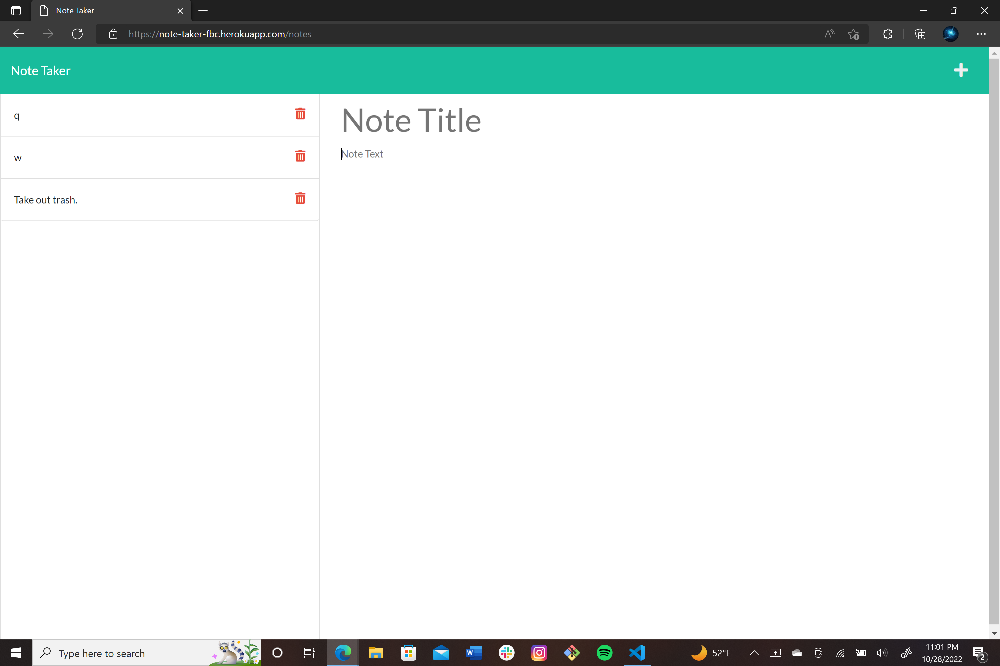

# Note Taker

## Description
The goal of this project was to build a webpage that can be used to write and save notes using express.js as the back end.

## [Webpage](https://note-taker-fbc.herokuapp.com/)


## Code Snippet
This snippet takes the user input and adds it to the database.
```JavaScript
if (title && text) {
        const newNote = {
            title,
            text,
            id: uniqid(),   //assigns id
        };

        fs.readFile('./db/db.json', 'utf-8', (err, res) => {
            if (err) {
                console.error(err);
            } else {
                const data = JSON.parse(res);
                data.push(newNote); //pushes newnote to db.json
                notes = data;
                fs.writeFile('./db/db.json', JSON.stringify(data, null, 3),
                    (err2) => err2 ? console.error(err2) : console.info('Notes Updated!')
                );
            }
        });

        res.json({ status: 'success', body: newNote, });
    }
```

## Author Links
[LinkedIn](https://www.linkedin.com/in/alexis-zaragoza-5baa51242/)
[GitHub](https://github.com/turtle2001)